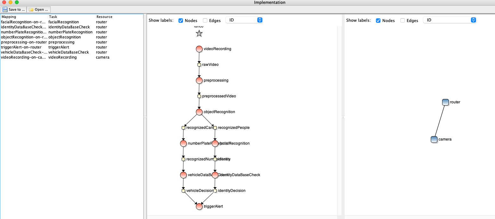
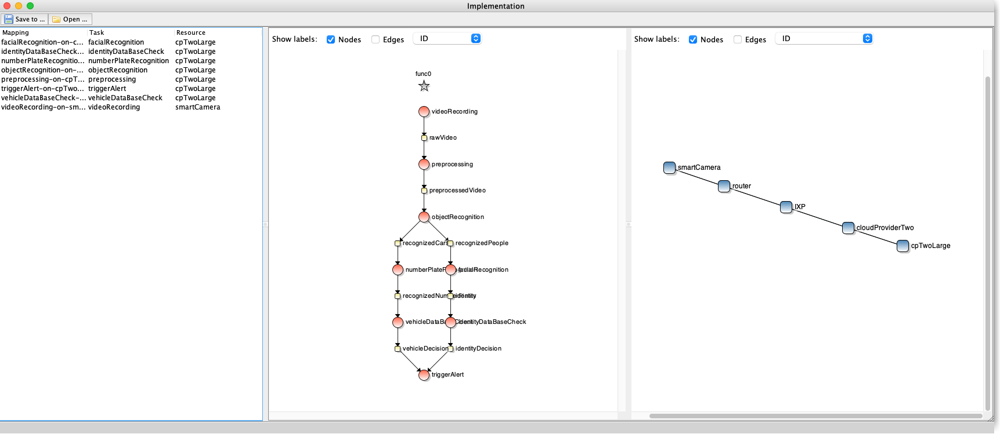

# Results

## Min costs
The solution that minimizes the costs can be seen in the image below. 

While the costs are the lowest with 20.0, the makespan is also the highest of all found solutions with 28.2.
It can also be seen that the only resources are the router and the webcam. Thus no leased hardware is used which leads to the lowest costs.
(The government of Distopistan must have developed extremly powerful routers to do the facial recognition on them 😆 ) 

## Lowest makespan for
The solution that minimizes the makespan can be seen in the image below.

For this soltuion the makepspan is 6.4 and the cost is 93.
The used resources are the smartCamera, router, IXP, cloudProvderTwo and the cpTwoLarge. Thus the system depends on leased hardware.

Compared to the min costs solution, the solution with the minimal maskespan is 4.4 times faster but also 4.65 times more expensive.